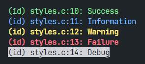
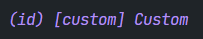

# Beeper

A simple C logging library featuring
- multiple, completely independent instances,
- multiple output streams, either for narrow or wide characters and with the option to disable the formatting, and
- customizable output styles, allowing users to choose which elements to include in the log messages, adjust text color and attributes, and define a callback function to be called whenever a log message is sent.

This project is the successor to my bad, purely macro-based [logging](https://github.com/thechnet/logging).

## Building it

- Ensure you have
  - a working C compiler
  - [CMake](https://cmake.org)
  - a build system
- Create a "build" directory in the repository root and `cd` into it
- Run `cmake`
- Build the library using your build system

## Including it

- Add `build/libbeeper.a` to your project source
- Include `build/beeper.h` in your source code

## Using it

### Instances

Although it supports multiple instances, Beeper is primarily designed for single-instance applications. For this reason, instead of explicitly providing an instance alongside each operation, users define a global *active beeper* to receive all requests.

Start by creating a beeper, providing a short identifier to indicate what the instance represents:
```C
bp_beeper beeper = bp_beeper_new(/* identifier: */ "id");
```
> If you're only going to use a single instance, you can discard the return value of this function – it's only used to switch between instances.

Newly created beepers are automatically selected as active beeper. You can select a different instance like this:
```C
bp_beeper_select(/* handle: */ beeper);
```

Once you're done logging, destroy the active beeper to release the memory it occupied:
```C
bp_destroy();
```

### Recipients

Before we can start logging, we need to add some recipients to our beeper. Recipients consist of a `FILE*` alongside some options.

Let's add `stdout` as a recipient:
```C
bp_recipient_add(/* stream: */ stdout, /* wide: */ false, /* formatted: */ true);
```

If you need to remove a recipient, you can do so as follows:
```C
bp_recipient_remove(/* stream: */ stdout);
```

> Recipients are cleaned up as part of `bp_destroy()`, so there's no need to remove them manually.

### Logging

Now we can start logging messages. For example, we can log a warning as follows:
```C
beep(/* style: */ warn, "Problematic integer: %d", 45)
```

The `beep` macro accepts a message style (see [Styles](#styles)), followed by a (literal!) format string and the values to go alongside it (Beeper wraps around the `printf` family of functions).

For more control, there are also the `beep_with` (to explicitly select an instance for this specific message), `beep_at` (to supply a custom origin file and line), and `beep_with_at` (both) macros.

The header also declares some macros useful for quick debugging. For example, you can quickly log the value of an integer as follows:

```C
int integer = 46;
beep_i(integer);
```

Refer to the header to find the other types you can log in this manner.

### Styles

Beeper offers the following built-in message styles: `success`, `info`, `warn`, `fail`, and `debug`.



However, we can also add our own or overwrite the existing ones:
```C
bp_style_set(/* name: */ "custom", /* style: */ (bp_style){
  .foreground_color = BP_COLOR_DARK_PURPLE,
  .italic = true,
  .show_style = true,
  .hide_origin = true
});
```
> Refer to the header to discover all the stylization options.

This style produces the following output:



To unset a style, use the following function:
```C
bp_style_unset(/* name: */ "custom");
```

> If your style overwrote a built-in style, unsetting it restores the built-in one. Also, like the recipients, custom styles are cleaned up as part of `bp_destroy()`, so it's not required to manually unset them.
